```{r setup, include=FALSE}
# R options
options(
  htmltools.dir.version = FALSE, # for blogdown
  show.signif.stars = FALSE,     # for regression output
  warm = 1,
  crayon.enabled = FALSE
  )
# Set dpi and height for images
library(knitr)
opts_chunk$set(fig.height = 2.65, dpi =300, warning=FALSE, message=FALSE) 
# ggplot2 color palette with gray
color_palette <- list(gray = "#999999", 
                      salmon = "#E69F00", 
                      lightblue = "#56B4E9", 
                      green = "#009E73", 
                      yellow = "#F0E442", 
                      darkblue = "#0072B2", 
                      red = "#D55E00", 
                      purple = "#CC79A7")

library(tidyverse)
library(gridExtra)
htmltools::tagList(rmarkdown::html_dependency_font_awesome())
### xaringan::inf_mr() -> use this for display within Rstudio

xaringanExtra::use_share_again()
xaringanExtra::style_share_again(
  share_buttons = "none"
)

htmltools::tagList(
  xaringanExtra::use_clipboard(
    button_text = "<i class=\"fa fa-clipboard\"></i>",
    success_text = "<i class=\"fa fa-check\" style=\"color: #90BE6D\"></i>",
    error_text = "<i class=\"fa fa-times-circle\" style=\"color: #F94144\"></i>"
  ),
  rmarkdown::html_dependency_font_awesome()
)
```

name: topics

## Topics
You can click the following links to navigate through the slides (in the HTML version).

* [What are we doing today?](#welcome)
* [What are statistics and data science?](#stats)
* [What is algorithmic bias?](#bias)
* [What can we learn from exploring and visualizing data from Spotify's API?](#spotify)

---
class: middle, center, inverse
name: welcome
# What are we doing today?

.header[<u>[Go to topics list](#topics)</u>]

---

```{r, echo=FALSE, fig.align='center', out.width="88%"}
knitr::include_graphics("libs/images/2021-04-24_cherry-blossoms.jpg")
```

.small[.footnote[Cherry trees outside Robarts Library, University of Toronto, St George Campus, 2021-04-24]]

---
## Go to https://pollev.com/bolton to answer (keep the link open)

```{r, echo=FALSE, fig.align='center', out.width="55%"}
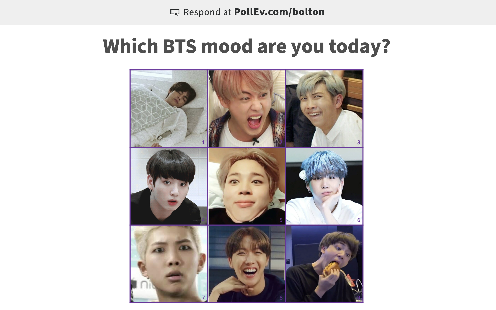
```


.footnote[Doesn't matter if you don't know who's who, just go with the vibe.]

---
## The plan

* Meet Liza and Nnenna [20 minutes]
* [What are statistics and data science?](#stats)  [10 minutes]
* Scavenger hunt / break [5 minutes]
* Scavenger hunt share [10 minutes]
* [What is algorithmic bias?](#bias) [30 minutes]
* Movement break [5 minutes]
* [What can we learn from exploring and visualizing data from Spotify's API?](#spotify) [40]
* Capstone [60 minutes]

---
## Hi, I'm Liza!

.pull-left[

You can call me Liza (pronounced like: "lie" and "zuh"). 

* liza.bolton@utoronto.ca
* Assistant Professor, Teaching Stream
* Department of Statistical Science, Univeristy of Toronto

.midi[
I currently teach a range of university courses, but all of them touch on how we explore and visualize data, how we can learn from data, how we communicate what we find to others (statisticians and non-statisticians alike) and ethical considerations for people making decisions with data. ]
]

.pull-right[
.small[
* I used to be a Statistical Consultant in New Zealand, working with small and medium companies on a big range of topics, from things like vehicle traffic to people's experiences in their first jobs after university.
* My research interests include how people's social and economic positions are related to health and topics in statistics education.
* What do stats undergraduates do? One of my students is currently finishing a project on Broadway musicals, while another is looking at big events like terrorist attacks or elections influence people's confidence in spending money. Students in my consulting course are exploring mask-wearing behaviour in Toronto, how COVID has impacted how people use the university library, the survival of painted turtles and the mating habits of Japanese fish.

__Data are everywhere and so statistical skills are needed everywhere too.__
]
]

---
### Introductions in the New Zealand way

```{r, echo=FALSE, fig.align='center', out.width="75%"}

```

---

```{r, echo=FALSE, fig.align='center', out.width="65%"}

```

---

```{r, echo=FALSE, fig.align='center', out.width="85%"}
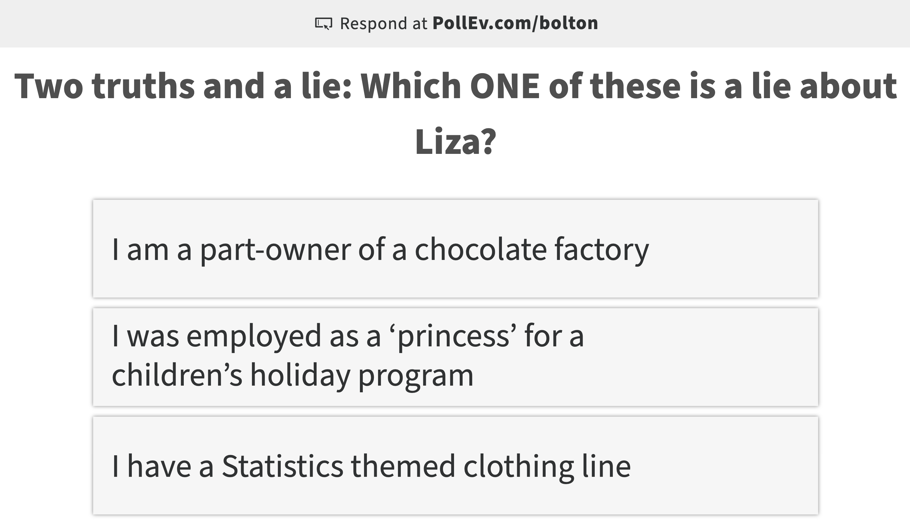
```

---

.pull-left[
Nnenna and I have worked on several things together. She is currently a teaching assistant for my 3rd year course and these are photos from some Zoom events we ran in the department in 2020. We both love statistics and dressing up!

```{r, echo=FALSE, fig.align='center', out.width="100%"}
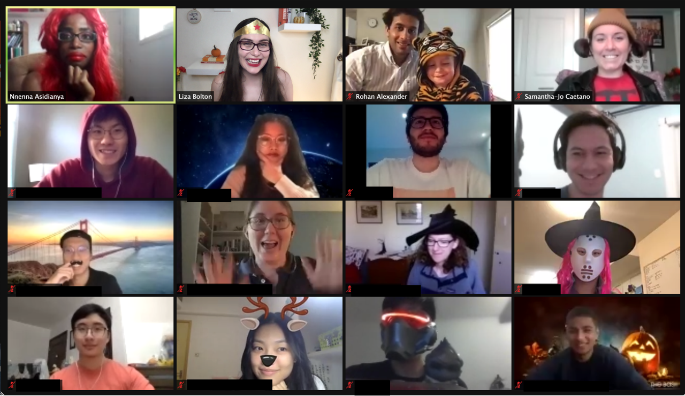
```
]
.pull-right[
```{r, echo=FALSE, fig.align='center', out.width="100%"}

```

.footnote[Wanna see more of what our department gets up to? Check out our recent news: https://www.statistics.utoronto.ca/news]

]


---
## Nnenna Asidianya

Hi, I'm Nnenna. I am in my second year as a PhD student in the Department of Statistical Sciences at University of Toronto.

.midi[Since I began my career in biological sciences, a lot of my earlier work was at the interface of clinical sciences and life sciences.  In the past, I did quite a lot of work in clinical sciences and published a paper in Gastric cancer risk and non-native status in Ontario. Currently, I am collaborating on a project with a nephrologist that will examine the risk factors for kidney graft failure.

I am also interested in geospatial statistics. This may be informed by my interest in disease progression and how we can really examine the factors that influence the progression over time.    

For the past few terms, I have taught introductory statistics to social science students. In this course we have covered a broad range of topics in relation to the pandemic. One that comes up is distance education and the ramifications of online learning considering the pandemic. There is a lot of space for statistical education that is emerging which is something that has always been an interest for me. There is a lot you can really explore with statistical sciences!]

---

```{r, echo=FALSE, fig.align='center', out.width="85%"}
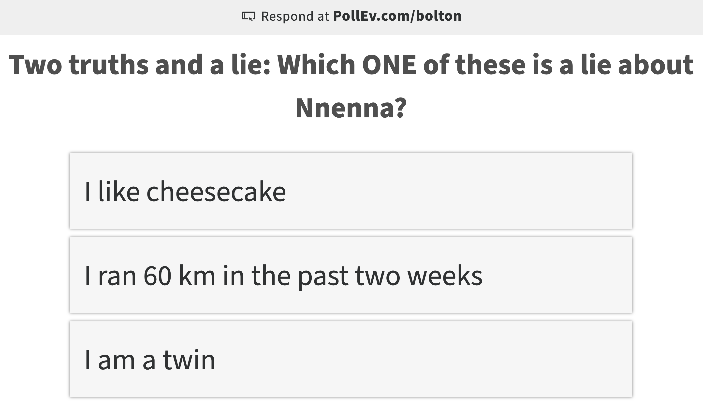
```

---
class: middle, center, inverse
name: stats
# What are statistics and data science?

.header[<u>[Go to topics list](#topics)</u>]

---
# Statistics and data science

Statistics is the art and science of __learning from data__. It also gives us ways to quantify __uncertainty.__

Data Science is a relatively new interdisciplinary field that also includes the computational aspects of acquiring, managing, and analysing data. Both __reasoning__ with and __computing__ with data play important roles in these related disciplines. 


---
## What are they not?

Statistics and data science are _NOT_...

.pull-left[
```{r, echo=FALSE, fig.align='center', out.width="100%"}
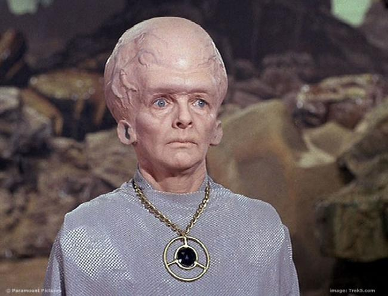
```
]

.pull-right[
```{r, echo=FALSE, fig.align='center', out.width="75%"}
knitr::include_graphics("libs/images/cat-type.gif")
```
]

---
.pull-left[
## What is statistics?
```{r, echo=FALSE, fig.align='center', out.width="80%"}
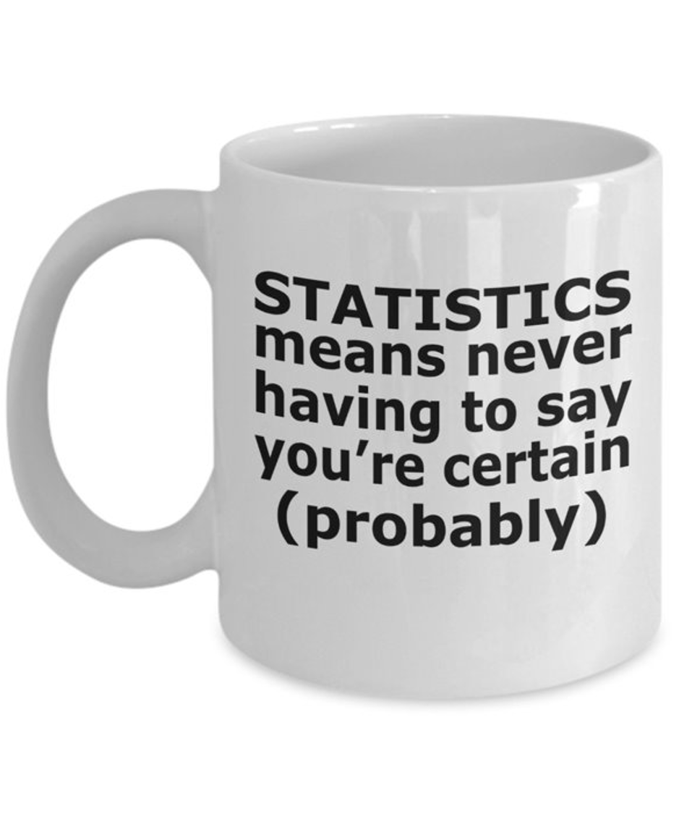
```
]

.pull-right[
```{r, echo=FALSE, fig.align='center', out.width="75%"}
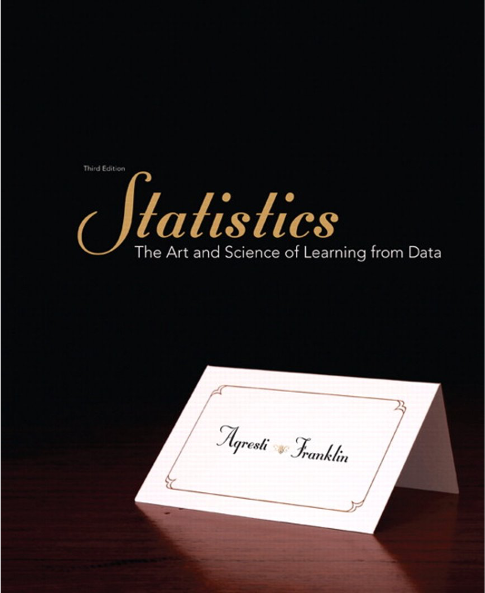
```
]

---
## What is statistics?

```{r, echo=FALSE, fig.align='center', out.width="90%"}
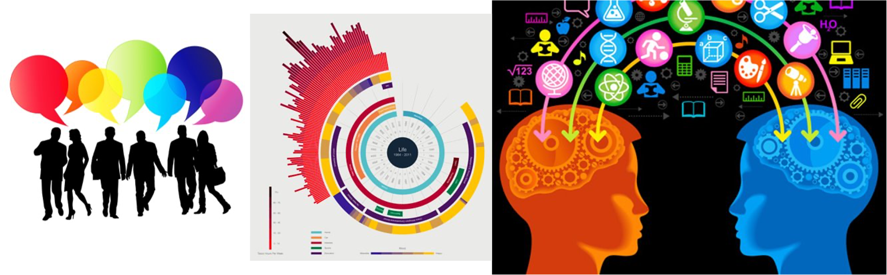
```

---
## Who needs statisticians and data scientists?

```{r, echo=FALSE, fig.align='center', out.width="95%"}

```

---

```{r, echo=FALSE, fig.align='center', out.width="70%"}

```

---

```{r, echo=FALSE, fig.align='center', out.width="85%"}
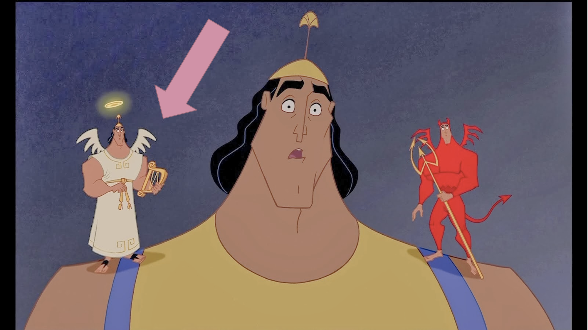
```

---

```{r, echo=FALSE, fig.align='center', out.width="85%"}
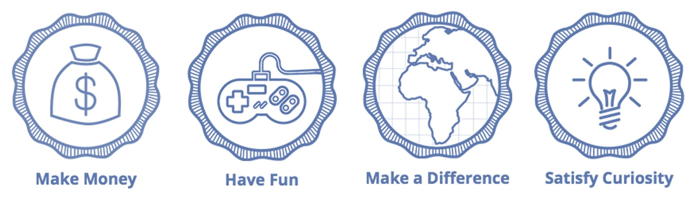
```

```{r, echo=FALSE, fig.align='center', out.width="85%"}
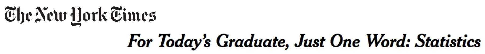
```

---

## Examples you came up with how data is collected about you in your data-to-day life (1)

* The amount of times I open my phone. Which would help me in knowing how often I use my phone and if I need to cut back on it.
* I think going to school data could be collected by the attendance that the teachers take daily. (maybe even twice a day)
* When I search for a product or item on Google. Google collects data on my interests then posts advertismments related to the previously searched items on my other used platforms like YouTube and Instagram.
* An example would be when teachers collect feedback from student in the course. Then, they use the responses to change their teaching style or modify the way they do things in the course.
* The data can be collected about your trip to help the Toronto Transit Commission, where you're coming from, where you are going, and how long it took for you to get there.

---

## Examples you came up with how data is collected about you in your data-to-day life (2)

* I've been shopping online a lot recently, so the data from the websites that I'm frequently on are often being collected in order for other websites to determine what ads they should show me. 
* I take the bus to and from school so google maps collects my data about my journey there and which buses and routes would be faster and how I can cut down on my travel from or to school.
* One way that data is collected about me and/or used to make decisions in my day-to-day life is when I use Instagram each day. The data collected about my instagram history can be helpful for business to post ads about certain things I like and want to know more about.  In conclusion, this is one way that data is collected about me and/or used to make decisions in my day-to-day life.

---

## Examples you came up with how data is collected about you in your data-to-day life (3)

* An example would be at the store and a new cereal has come out. The data will be collected by trying to figure out how many people are consuming this product, this way it tells companies if their product is good and making money, or going under in prices. This data will tell companies if they should keep the cereal or discontinue it.
* Data is collected on streaming services such as Netflix, Disney Plus, etc. to determine what kind of media I like to consume, and then recommend other shows/movies that they believe I would enjoy based on what they collected. This also works with sites such as YouTube, and music services like Apple Music and Spotify.

---
## Examples you came up with how data is collected about you in your data-to-day life (4)
* Back when we had in-person school amidst the pandemic, our school required us to complete these surveys to determine whether we could come into school or not. It was a necessity to keep the numbers down. The school themselves took these numbers and saw the ratio of potential COVID-19 carriers and healthy people, and determined whether they were allowed in.
* Advertisements that pop up for me tend to be correlated to my internet search history. For example, if I search up a variety of computers on BestBuy, I will generally see an ad on YouTube soon after from BestBuy.
* One way that data is collected from me is when websites I go on use cookies to collect my information and sell it to Google so that they can target their ads.

---
class: middle, center, inverse

# Scavenger hunt and break (5 minutes)

.large[
* Go find ONE thing that is related to data and/or statistics in some way. Be creative!
* Grab some water/a snack etc.
]

---
class: middle, center, inverse
name: bias
# What is algorithmic bias?

.header[<u>[Go to topics list](#topics)</u>]

---
## Algorithmic bias

.midi[Prediction models are taught what they "know" from training data. 
Training data can be incomplete, biased, or skewed. This can result in
__algorithmic bias__.]

### Proxy variables

.midsmall[There can also be situations where we know we DON'T want to use a variable as part of an algorithm, for ethical and often legal reasons (anti-discrimination laws about gender, race, health status, e.g. American's with Disabilities Act means you can't discriminate against people with mental health conditions). BUT there might be other variables in your data, like certain types of hobbies/memberships, home address, 'personality' quiz questions, that act as 'proxies' for these things, meaning they end of determining outcomes even when you don't want them to.]

.small[
__Optional reading__
+ Amazon scrapped 'sexist AI' tool, BBC, 2018. https://www.bbc.com/news/technology-45809919 
+ Amazon discreetly abandoned gender-biased AI-based recruiting tool, HRK News, 2018 https://www.hrkatha.com/recruitment/amazon-discreetly-abandoned-gender-biased-ai-based-recruiting-tool/
]

---
## Should algorithms be transparent?

Some predictive algorithms give us more than just a prediction: they also give us some
insight as to what factor(s) influenced the prediction. Examples you might have encountered in your studies already include linear regression models and classification trees.

Other algorithms yield predictions, but no information about how it got from the inputs
to the prediction, such as neural networks (you may see these in future courses). These are sometimes called 'black box' algorithms and many machine learning tools fall into this. We'll briefly talk more about this when we discuss generalized additive models later in the course. 

What is more important - getting the most accurate predictions, or understanding the factor(s) which influence a prediction?

---
class: middle 

## Suggested reading

Lum, K & Isaac, W. _To predict and serve?_ (2016). https://rss.onlinelibrary.wiley.com/doi/full/10.1111/j.1740-9713.2016.00960.x#sign960-bib-0001

.pull-left[
.midi[
This article is an excellent and accessible introduction to ideas around predictive policing and the current issues.  

(Lum's other work, previously as the Lead Statistician at the Human Rights Data Analysis Group and now as a prof at the University of Pennsylvania is awesome!)
]]

.pull-right[

```{r, echo=FALSE, fig.align='center', out.width="95%"}
include_graphics("libs/images/precog.gif")
```

.small[(If you've seen Minority Report, maybe you were already skeptical about predicting crimes before they happen...but probably for different reasons.)
]]

---
class: middle, center, inverse

# Movement break (5 mins)

```{r, echo=FALSE, fig.align='center', out.width="70%"}
include_graphics("libs/images/stretch.png")
```

---
class: middle, center, inverse
name: spotify
# What can we learn from exploring and visualizing data from Spotify's API?

.header[<u>[Go to topics list](#topics)</u>]

---

## Using an API

API stands for __a__pplication __p__rogramming __i__nterface. 

It is a structured way for data (broadly) requests to be made and fulfilled with computers. 

I like [this](https://www.howtogeek.com/343877/what-is-an-api/) comparison to a restaurant menu. You don't need to know HOW to make crème brûlée to be able to know you WANT it.

--

If you are using an API, there still may be rules about things like how many requests you can make in a certain time frame and rate limiting. Make sure you're aware of these rules and behave in the spirit of them!

Optional reading: https://beanumber.github.io/mdsr2e/ch-ethics.html#sec:terms-of-use 

---
.pull-left[
.tiny[
```{r, echo=FALSE}
readRDS("data/student.RDS") %>% 
  arrange(artist) %>% 
  slice(1:18) %>% 
  knitr::kable()
```
]
]

.pull-left[
.tiny[
```{r, echo=FALSE}
readRDS("data/student.RDS") %>% 
  arrange(artist) %>% 
  slice(19:36) %>% 
  knitr::kable()
```
]
]


---
## Data dictionary (reference slides)

Description of variables available to you (3 slides). 'Class'

|variable                 |class     |description |
|:---|:---|:-----------|
|artist_name             |character | Song artist|
|artist_popularity       |number | Popularity score (0-100) based on track play and recency. Higher is better |
|artist_followers        |number | Number of people who 'follow' the artist on Spotify|
|album_name              |character| Name of the album the song if from |
|album_release_year      |number | Year of album release|
|track_name              |character | Song name|

---

.small[
|variable                 |class     |description |
|:---|:---|:-----------|
|danceability            |number    | Danceability describes how suitable a track is for dancing based on a combination of musical elements including tempo, rhythm stability, beat strength, and overall regularity. A value of 0.0 is least danceable and 1.0 is most danceable. |
|energy                   |number    | Energy is a measure from 0.0 to 1.0 and represents a perceptual measure of intensity and activity. Typically, energetic tracks feel fast, loud, and noisy. For example, death metal has high energy, while a Bach prelude scores low on the scale. Perceptual features contributing to this attribute include dynamic range, perceived loudness, timbre, onset rate, and general entropy. |
|loudness                 |number    | The overall loudness of a track in decibels (dB). Loudness values are averaged across the entire track and are useful for comparing relative loudness of tracks. Loudness is the quality of a sound that is the primary psychological correlate of physical strength (amplitude). Values typical range between -60 and 0 db.|
|speechiness              |number    | Speechiness detects the presence of spoken words in a track. The more exclusively speech-like the recording (e.g. talk show, audio book, poetry), the closer to 1.0 the attribute value. Values above 0.66 describe tracks that are probably made entirely of spoken words. Values between 0.33 and 0.66 describe tracks that may contain both music and speech, either in sections or layered, including such cases as rap music. Values below 0.33 most likely represent music and other non-speech-like tracks. |
|acousticness             |number    | A confidence measure from 0.0 to 1.0 of whether the track is acoustic. 1.0 represents high confidence the track is acoustic.|
]

---

.small[
|variable                 |class     |description |
|:---|:---|:-----------|
|instrumentalness         |number    | Predicts whether a track contains no vocals. “Ooh” and “aah” sounds are treated as instrumental in this context. Rap or spoken word tracks are clearly “vocal”. The closer the instrumentalness value is to 1.0, the greater likelihood the track contains no vocal content. Values above 0.5 are intended to represent instrumental tracks, but confidence is higher as the value approaches 1.0. |
|liveness                 |number    | Detects the presence of an audience in the recording. Higher liveness values represent an increased probability that the track was performed live. A value above 0.8 provides strong likelihood that the track is live. |
|valence                  |number    | A measure from 0.0 to 1.0 describing the musical positiveness conveyed by a track. Tracks with high valence sound more positive (e.g. happy, cheerful, euphoric), while tracks with low valence sound more negative (e.g. sad, depressed, angry). |
|tempo                    |number    | The overall estimated tempo of a track in beats per minute (BPM). In musical terminology, tempo is the speed or pace of a given piece and derives directly from the average beat duration. |
|mode_name                    |character    | Mode indicates the modality (major or minor) of a track, the type of scale from which its melodic content is derived. |
|duration_ms                    |number    | Length of the song in miliseconds. |
|explicit                       |logical   | Is the song rated explicit? |
|artist_genre                   |character | This variable is still a little messy, but you can see the genres that the artist's music is considered to belong to.|
]

---
# What I really hope works

Go to this link: https://jupyter.utoronto.ca/hub/user-redirect/git-pull?repo=https%3A%2F%2Fgithub.com%2Felb0%2Fpursuestem_activity&urlpath=shiny%2Fpursuestem_activity%2Finst%2Ftutorials%2Fpursuestem%2F&branch=master

It may ask you to log in! Use the same login that gives you access to Quercus. 

# If this doesn't work, our back up will be:

* https://lite.docker.stat.auckland.ac.nz/
* Get data by saving this page as a CVS: https://raw.githubusercontent.com/elb0/pursuestem_activity/master/data/for_students.csv 

---
## Add your visualization to our group collection

Link: https://utoronto-my.sharepoint.com/:p:/g/personal/liza_bolton_utoronto_ca/Ec7sIb7iJSlJqPt72LXO6B8BAloASxohymcxxrfDp9CXlQ?e=PEZKFE

---
# A playlist

I made a new __variable__ that was just `danceability` score + `valence` score and found the track with the highest values for each of the artists:

https://music.youtube.com/playlist?list=PLbNVvLDdpWVKZWcUoeeMyrY4oNFtEiUU5

(There is actually a way to make a Spotify playlist directly from the statistical software I use, but I haven't got my authorizations set up properly yet...YouTube music is the one I have ad-free, anyway)

---
class: inverse, middle

# Capstone time!

.header[<u>[Go to topics list](#topics)</u>]

```{r eval = FALSE, echo = FALSE}

pagedown::chrome_print("pursue-stem_stats.html", wait = 20)

```
